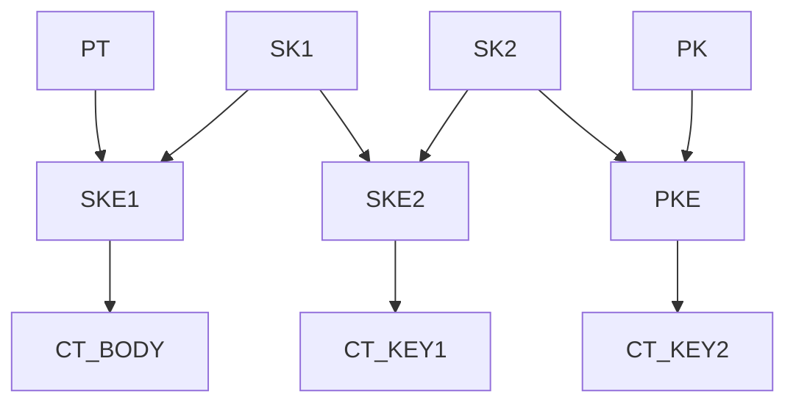

Cascade - Encryption and signing library for x-brid encryption via several cryptographic suites.
--
[](https://badge.fury.io/js/crypto-cascade)
[](https://circleci.com/gh/junkurihara/cascade)
[](https://coveralls.io/github/junkurihara/cascade?branch=develop)
[](https://codeclimate.com/github/junkurihara/cascade/maintainability)
[](https://opensource.org/licenses/MIT)

> **WARNING**: At this time this solution should be considered suitable for research and experimentation, further code and security review is needed before utilization in a production application.

# Introduction and Overview

# Supported Crypto Suites

This library currently supports two cryptographic suites, OpenPGP and js-crypto-utils. We adopted [openpgpjs](https://openpgpjs.org/) as an implementation of OpenPGP. On the other hand, [js-crypto-utils](https://github.com/junkurihara/jscu) is a simple crypto suite for plain implementations of cryptographic functions unlike fully-specified suites like OpenPGP. We should note that js-crypto-utils can be viewed as a integrated wrapper or interfaces of RFC standardized functions that are mostly built-in ones of browsers and Node.js.

* Encryption and decryption:
  * js-crypto-utils
    * Public key encryption (ECDH, HKDF and AES256-GCM combination)
    * Public key encryption (RSA-OAEP)
    * Session key encryption (AES-GCM)
  * OpenPGP
    * Public key encryption (Elliptic curve cryptography)
    * Public key encryption (RSA)
    * Session key encryption (AES-EAX)
* Signing and verification:
  * js-crypto-utils
    * RSA-PSS signature (May not work in IE11 and Edge.)
    * RSASSA-PKCS1-v1_5 signature
    * ECDSA signature
  * OpenPGP
    * RSA signature
    * ECDSA signature
* Key generation:
  * js-crypto-utils
    * Public and private key pair generation w/ and w/o passphrase in PEM armored format (ECC and RSA)
    * Session key generation
  * OpenPGP
    * Public and private key pair generation w/ and w/o passphrase in OpenPGP armored format (ECC and RSA)
    * Session key generation

# Installation and Setup

## Installation

At your project directory, first do either one of the following.

```shell
$ npm install --save crypto-cascade # from npm
$ yarn add crypto-cascade # from yarn
```

Then import the `Cascade` library as follows.

```javascript
import cascade from 'crypto-cascade'
```

Of cource, you can also directly import the source code by cloning this Github repo.

## Finishing up the setup

The `Cascade` library doesn't internally import cryptographic suites, i.e., `js-crypto-utils` and `openpgpjs` in a static manner, but it loads them in a dynamic manner. In particular, it calls those suites via `require` for `Node.js` and as `window` objects for browsers. This means that **for browsers, both of or either one of `js-crypto-utils` (`jscu.bundle.js`) and `openpgpjs` (`openpgp.js`/`openpgp.min.js`) must be pre-loaded by `<script>` tags in html files**. Also we should note that for `openpgpjs`, the webworker file `openpgp.worker.js`/`openpgp.worker.min.js` is required to be located in the directory where the `openpgp.js`/`openpgp.min.js` exists.

# Usage

Here we give some basic example of usecases of `Cascade`.

## Key generation

`Cascade` provides a basic function to generate PEM-formatted and OpenPGP-armored public private key pairs. The following example describes an example to generate PEM-formatted public and private keys of elliptic curve cryptography using `js-crypto-utils`.

```javascript
const keyParam = {
  suite: 'jscu', // use 'js-crypto-utils'
  keyParams: { type: 'ec', curve: 'P-256' }
};
const keyPair = await cascade.generateKey(keyParam);
const publicKeyPEM = keyPair.publicKey.keyString; // EC public key in PEM format
const privateKeyPEM = keyPair.privateKey.keyString; // EC private key in PEM format
```

Here we should note that for the key generation using `js-crypto-utils`, the generated public key is encoded as `SubjectPublicKeyInfo` specified as a part of X.509 public key certificate ([RFC5280](https://tools.ietf.org/html/rfc5280)). On the other hand, the generated private key is encoded as `PrivateKeyInfo`/`OneAsymmetricKey` defined in PKCS#8 ([RFC5958](https://tools.ietf.org/html/rfc5958)). Hence the private key can be encrypted with a passphrase just by passing API the passphrase string as given below.

```javascript
const keyParam = {
  suite: 'jscu',
  keyParams: { type: 'ec', curve: 'P-256' },
  passphrase: 'secret passphrase'
};
const keyPair = await cascade.generateKey(keyParam);
```

Then, the protected private key is encoded as `EncryptedPrivateKeyInfo`.

Note that in addition to `jscu` as `keyParam.suite`, `openpgp` is also available. The key generation API can generate not only EC public and private key strings but also RSA ones and session keys, where generated session keys are just random bytes given in `Uint8Array` unlike formatted strings of public and private keys.

## Basic encryption simultaneously with signing

The following example describes how to simply encrypt a message in `Uint8Array` (`String` is also accepted) simultaneously with signing on the given plaintext message in `Cascade`. Since the cascaded encryption, i.e., x-brid encryption, will be employed by chaining this basic encryption and decryption function, we shall firstly explain this basic function and its usage.

First of all, we need to import keys to be used, and obtain `Keys` object that will be used to encrypt and decrypt in `Cascade`.

```javascript
const encryptionKeys = {
  publicKeys: [ keys.publicKey.keyString ],
  privateKeyPassSets:[ { privateKey: keys.privateKey.keyString, passphrase: '' } ] // for Signing
};

// import encryption key strings
const encryptionKeyImported = await cascade.importKeys(
  'string',
  {keys: encryptionKeys, suite: {encrypt_decrypt: 'jscu', sign_verify: 'jscu'}, mode: ['encrypt', 'sign']}
);
```

The API `cascade.encrypt` returns an object consisting of `message` and `signature` sub-objects that are able to be respectively serialized with their instance method `serialize()`. Serialized encrypted message objects and signature objects can be de-serialized with `cascade.importEncryptedBuffer` and `cascade.importSignatureBuffer` functions and encrypted message and signature objects are obtained. By putting those de-serialized objects with imported decryption keys, the API `cascade.decrypt` returns a decrypted data and the result of signature verification.

```javascript
const encryptionConfig = {
  encrypt: {
    suite: 'jscu',
    options: { hash: 'SHA-256', encrypt: 'AES-GCM', keyLength: 32, info: '' }
  },
  sign: {
    required: true,
    suite: 'jscu',
    options: { hash: 'SHA-256' }
  }
};

// encrypt
const encryptionResult = await cascade.encrypt({
  message: messageSomeHowInUint8Array,
  keys: encryptionKeyImported,
  config: encryptionConfig
});

// serialize
const serializedEncrypted = encryptionResult.message.serialized();
const serializedSignature = encryptionResult.signature.serialize();

// deserialize
const deserializedEncrypted = cascade.importEncryptedBuffer(serializedEncrypted);
const deserializedSignature = cascade.importSignatureBuffer(serializedSignature);

const decryptionKeys = {
  privateKeyPassSets:[ { privateKey: keys.privateKey.keyString, passphrase: '' } ],
  publicKeys: [ keys.publicKey.keyString ] // for verification
};

// import decryption key strings
const decryptionKeyImported = await cascade.importKeys(
  'string',
  {keys: decryptionKeys, suite: {encrypt_decrypt: 'jscu', sign_verify: 'jscu'}, mode: ['decrypt', 'verify']}
);

// decrypt and verify
const decryptionResult = await cascade.decrypt({
  data: { message: deserializedEncrypted, signature: deserializedSignature },
  keys: decryptionKeyImported
});
```


## Cascaded x-brid encryption and signing

```javascript

```

